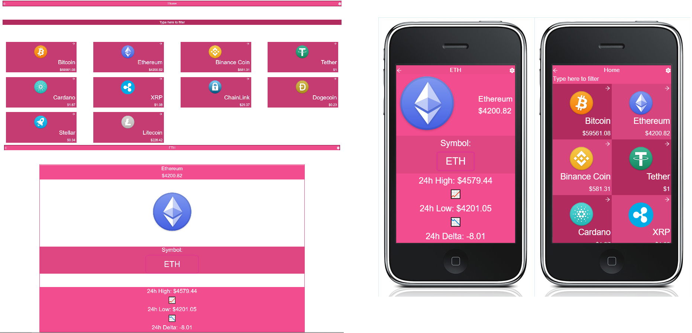

# React Capstone

> On this project I built a single page app, that retrieves info from a cryptocurrency API, displays the info on the homepage and allows you to navigate to the details page to see more specific information.

## Built With

- JavaScript
- React
- Redux
- CSS
- Jest
- Reacting Test Library

## Live Page

[Live Page](https://leolpaz-react-capstone.netlify.app/)

## Demo Video

[Video](https://drive.google.com/file/d/1qk3917-XSa0npW9rZGZ7LJPiSnnEVueL/view)

## Getting Started

To get a local copy up and running follow these simple example steps.

- Clone the repository with git clone https://github.com/leolpaz/React-Capstone.git;
- Install dependencies with npm i/yarn install;
- Use npm start/yarn start to create the dev server;
- Go to http://localhost:3000/ on your browser if it doesn't do it automatically once you create the dev server;
- Run "npm/yarn run test" to see if the tests are passing, everything should pass;

## Authors

👤 **Leonardo Paz**

- Github: [Leonardo Paz](https://github.com/leolpaz)
- Twitter: [Leonardo Paz](https://twitter.com/leonardolpaz95)
- Linkedin: [Leonardo Paz](https://www.linkedin.com/in/leonardo-paz-a925611b5/)

## 🤝 Contributing

Contributions, issues, and feature requests are welcome!

Feel free to check the [issues page](../../issues/).

## Show your support

Give a ⭐️ if you like this project!

## Acknowledgments

- Hat tip to anyone whose code was used
- Microverse

## Credits

- [Nelson Sakwa](https://www.behance.net/sakwadesignstudio) for the beautiful design
- [Coinlib](https://coinlib.io/) for the free API

## 📝 License

This project is [MIT](./MIT.md) licensed.
